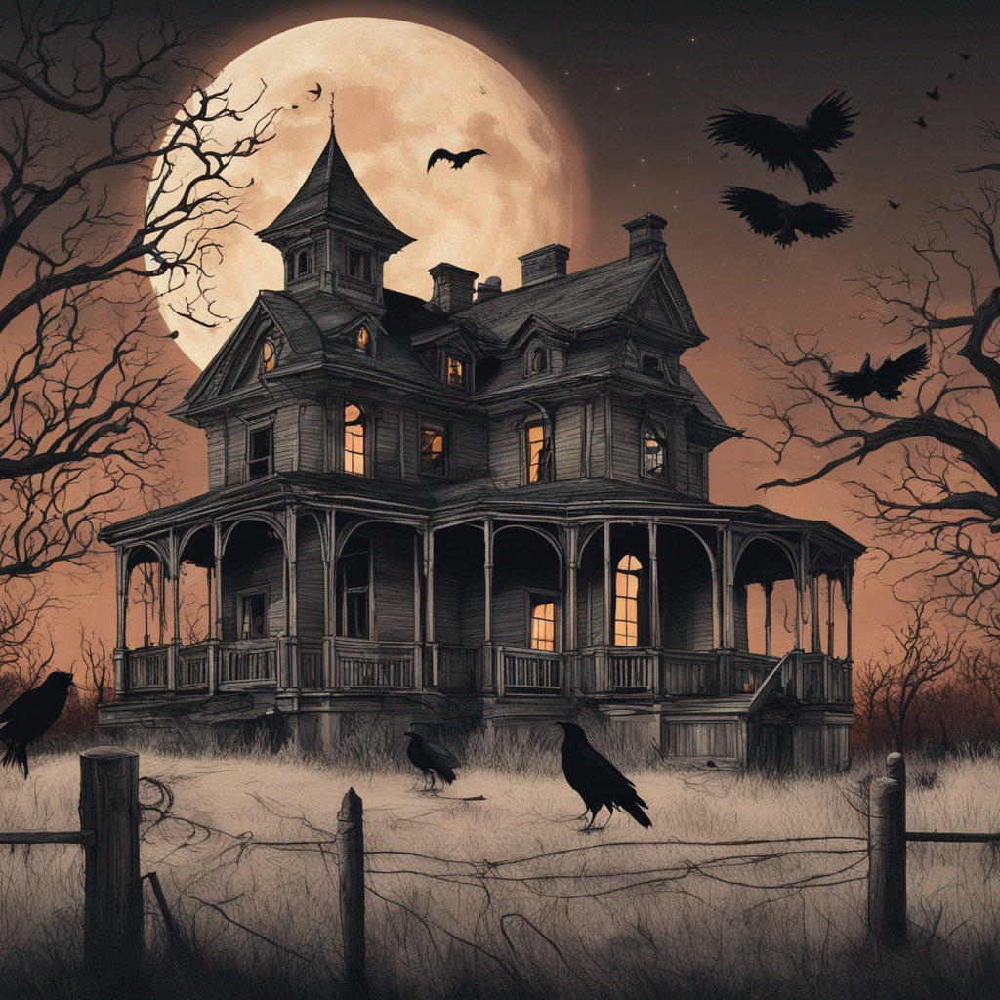
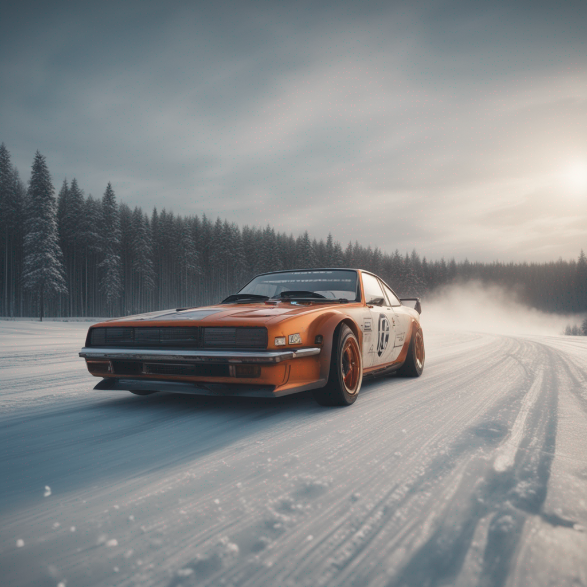
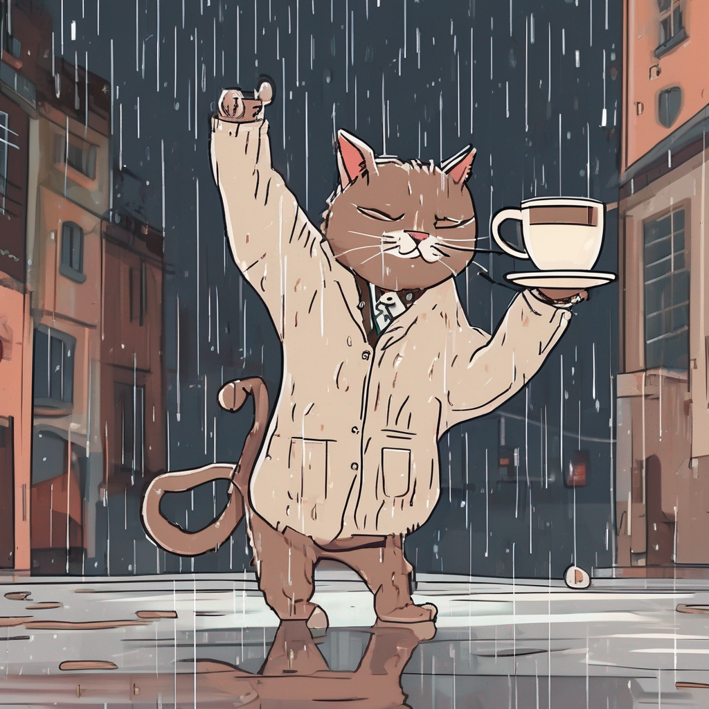
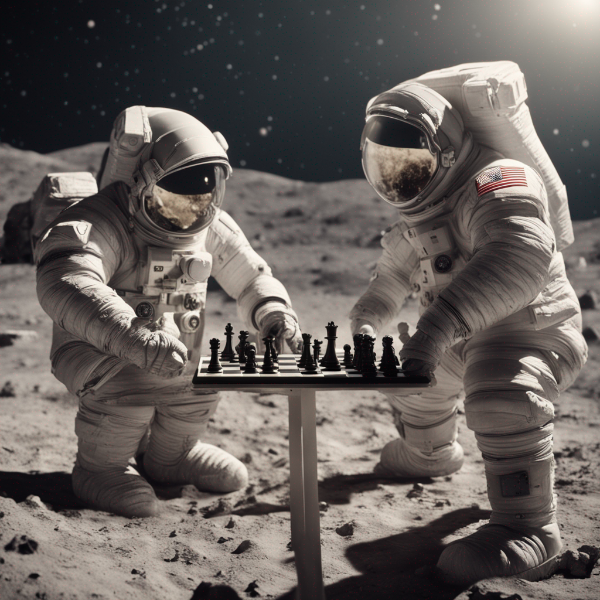

# Image Generation using Stable Diffusion

This project is simple demonstration of Image Generation using Stable Diffusion model built by Stability AI.

The project uses two models from the `diffusers` library *stable-diffusion-xl-base-1.0* and *stable-diffusion-xl-refiner-1.0* to generate images. These models are developed by [Stability AI](https://stability.ai/). The base model can be used as a solo module without refiner model.

## Usage 

The python notebook installs the diffusers and other required dependecies like transformers. It then loads both the models - base and refiner which are available on the huggingface site. Then we set some parameter like number of iterative steps to take for generating image, the denoising percentage for base and refiner model. There are various parameters that can be adjusted by user but for simplicity they are given default values which can be overridden. They are listed on their [documentation page](https://huggingface.co/docs/diffusers/api/pipelines/stable_diffusion/stable_diffusion_xl). Then the user's prompt is provided to the model and it generates the image.

## Theory

Though we directly use the models from the library, there are some important concepts upon which these models are built upon :

1) **[Autoencoder](https://en.wikipedia.org/wiki/Autoencoder)**: Autoencoder is a neural network that consists of two components: encoder and decoder. The encoder takes the raw input and convert into a coded representation while decoder takes such coded representation and tries produces an output that is similar to input.

2) **Diffusion models**: Diffusion models takes the training data, add some noise to distort or corrupt the image and then reverse the process (denoising or reverse diffusion) to generate the image back and thus learning to recover the image from random noise.

3) **[U-Net](https://arxiv.org/abs/1505.04597)**: This is a popular architecture in which encoding layers perform convolutional operations on an image to extract relevant features and the decoder layers augmented with actual image connections  upsample encoded feature and generate the segmentation map which can be used for further study or derive conclusions related to the image.

4) **[Cross attention mechanism](https://arxiv.org/abs/1706.03762)**: This was introduced as part of Transformers architecture where an output sequence is generated from two different input sequences based on the attention scores between the two inputs.

#### Idea
The overall idea of stable diffusion or [latent diffusion](https://arxiv.org/abs/2112.10752) is the image generating model operates on latent space representation of image rather than pixel space to lower the computation cost.
The latent representation is generated from the actual image with the help of an encoder. The latent space of image is then diffused to get noisy version of the image. Then this noisy image is passed through denoising component (UNet) conditioned with textual embeddings of the prompt using cross attention to get next form of input. The denoising is done iteratively to remove the noise gradually so the model learns the process of reverse diffusion. Finally, the previous output is further passed through decoder to generate the image.
During inference, the noise which is passed to UNet is coupled with the text prompt encoding which acts as a guide for the model to generate image.

## Examples

Some example images generated from the model

